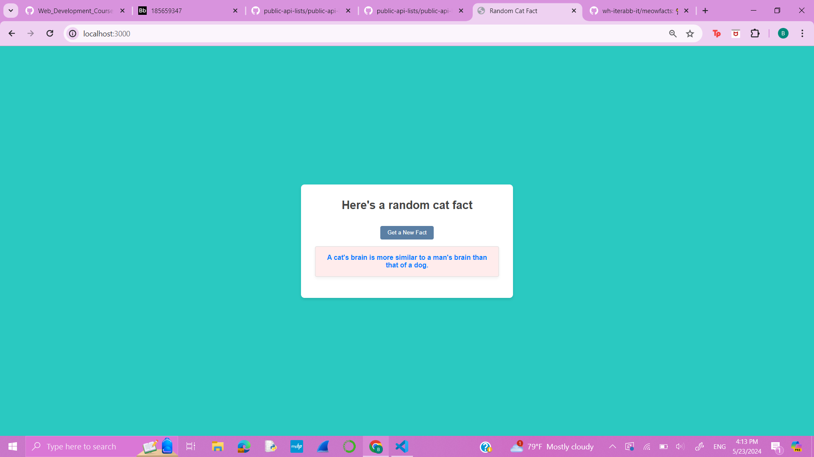

# Web page that prints random facts about cats
Brianna Persaud
Project #1

# The line of code that I used to run this file is: 
express_server/index.js

# How to I started my server
1. First I ran npm init to create the json file, then in the json file I added "version": "1.0.0",
2. Then I ran the command npm i express
3. After I ran npm i -g nodemon

# Here is a photo of the webpage   

